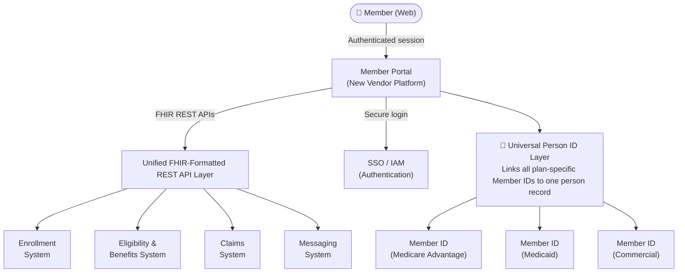
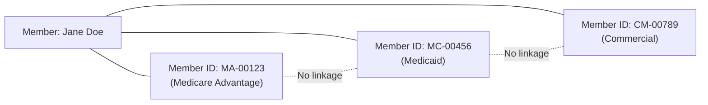
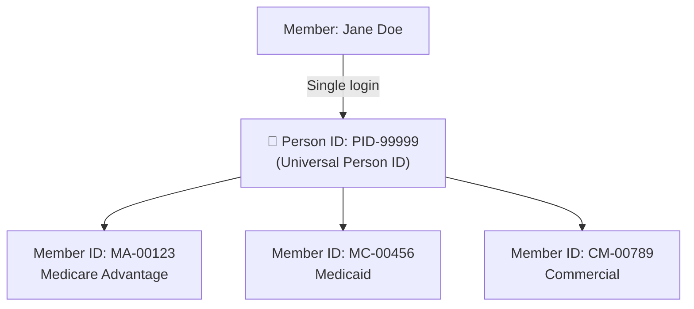
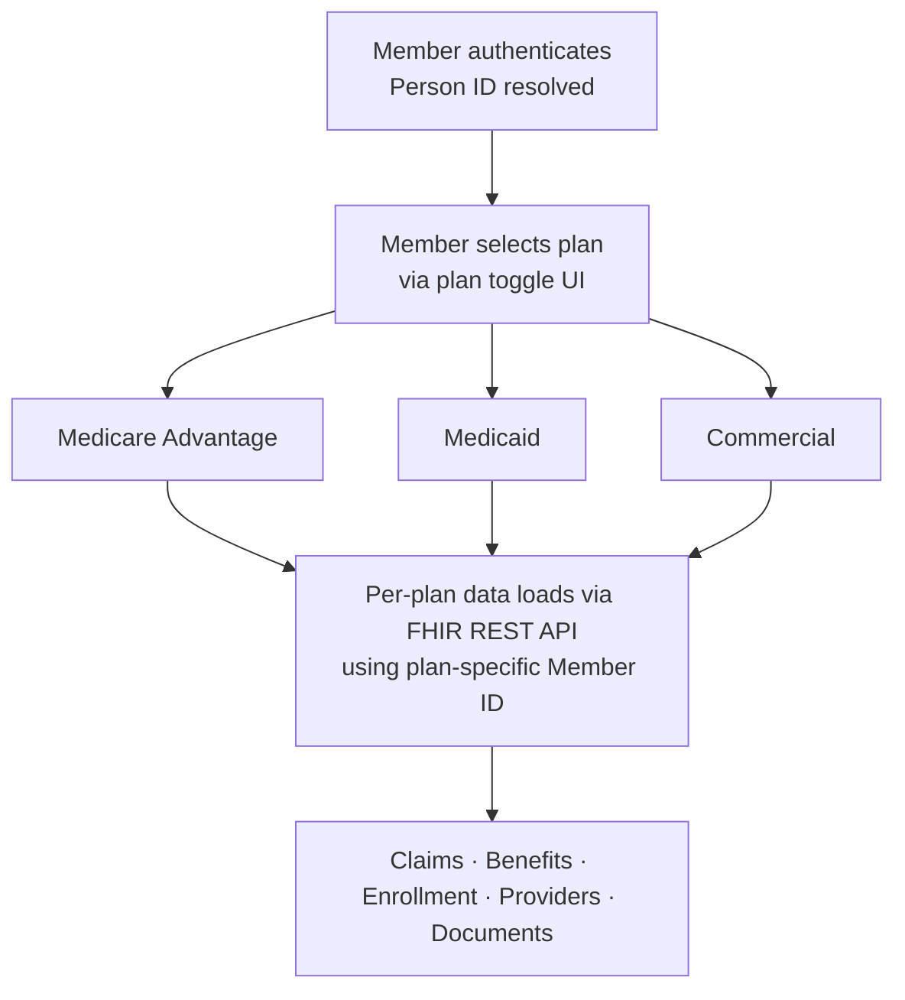

# Data Flow Diagram — Member Portal Modernization

## Portal Integration Architecture

---

## Universal Person ID — Before & After

### Before: Fragmented Identity Model

> Portal sees 3 separate people. No cross-plan view possible.

---

### After: Universal Person ID Model

> Single authentication. Member toggles between plans. Per-plan data loads dynamically.

---

## Plan Toggle Data Flow

---

*Diagram sanitized — system names, vendor identities, and internal identifiers removed.*
